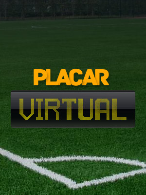
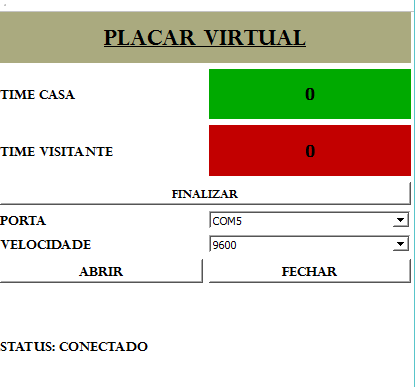
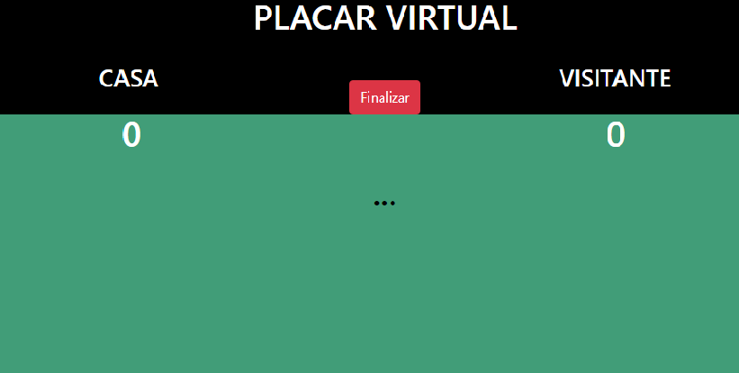
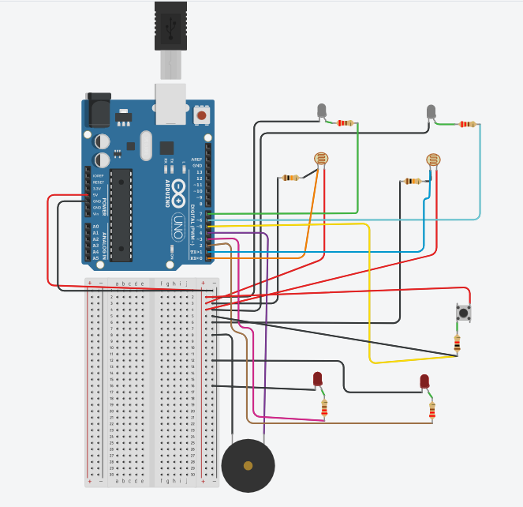

# Placar Virtual

Projeto Final Programação Estruturada

# Visão geral sobre o Placar Virtual:

O projeto consiste na aplicação de uma automatização para "mesas de pebolim"  com uma tecnologia capaz de identificar o momento exato que a bola cruza o gol adversário.
Tornando assim, uma maneira mais prática e usual para o dia-dia de pessoas que utilizam desse esporte uma brincadeira séria, em uma tecnologia integrada e de fácil utilização.

# Manual do usuário

### Como funciona o Placar Virtual?

Consiste em uma aplicação correta para a marcação de gols, com o uso de sensores responsáveis pela leitura no determinado momento que a bola cruza o gol. Sendo atualizável em um servidor web na qual será disponibilizado o site, para que o usuário possa acompanhar, como também dispõe de software paara o acompanhamento da partida.  

### Como adquirir o Placar Virtual?

Se desejas utilizar o software do Placar Virtual e usa uma distribuição Windows, Linux ou Mac, basta fazer o download do repositório e executar o arquivo PlacarVirtual.pro com o QT Creator.

# Utilização do Placar Virtual com o software

#### Monitoramento da Partida

Com a Tela do monitoramento aberta você pode identificar a função "porta", que é a administração das entradas usb do seu computador, onde você deverá conectar o cabo da sua esp8266. Logo após selecionada a porta, em seguida é preciso a sua velocidade, 115200 padrão da placa. O usuário poderá analisar o status do Placar Virtual, se está conectado ou desconectado, conforme sua conexão. Com a conexão feita, você poderá acompanhar a partida do "pebolim" conforme os gols forem sendo efetuados, e com a função de encerar a partida, pelo botão "FINALIZAR".

# Utilização do site do Placar Virtual

#### Monitoramento da Partida

O site do Placar Virtual permite ao usuário o monitoramento da partida ao vivo, com a função de controlar o fim da partida, com o botão "Finalizar" encontrada na parte central da página do Placar. 

# Esclarecimentos Técnicos 

### Matériais utilizados 

* NODEMCU-ESP8266
* PROTOBOARD
* LDR
* LED-ALTO BRILHO
* BUZZER 
* RESISTOR 220Ω
* RESISTOR 10K
* RESISTOR 1K
* PUSH BUTTON
* MESA DE "PEBOLIM"

## Circuito

Com o uso de sensores LDR com leds de alto brilho conseguimos fazer a leitura da passagem da bola no momento exato do gol, ligando o led do time que realizou o gol, tornando assim uma maneira prática e fácil para um grande problema que é a confirmação de gol em uma partida de "futebol", junto com a informação de gol, adicionamos um buzzer para acionar um som conforme cada gol for efetuado. E aprimorando o circuito colocamos um pushbutton para restaurarmos a partida no site como no software. 

## Servidor web

Com a pagina disponibilizada pelo heroku. Foram de fundamental importancia a utilização das linguagens html, css, para a formação do site. Como JavaScript e Python para a comunicação do site com a esp8266 e o servidor web.

## Software 

Com a criação do software para o monitoramento offline, caso o usuário esteja sem conexão à rede. Com a utilização da IDE QT Creator, com linguagem utilizada C++.
